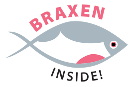
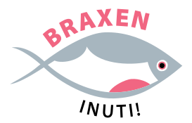

# Braxen 1.0

This is the public repository for **Braxen**, 
a software and dataset providing Swedish pronunciations for 
speech science and speech technology.

Please note that this is the first release of Braxen. 
The resource is under active development and will be 
continuously refined and updated.

To future-proof your workflow, consider incorporating 
an automated download and transformation process to 
ensure access to updates. 
The format of the text (TSV) version of 
the data resource will not be changed without 
an associated major version bump.

# Repo contents

- Documentation can be found in 
`/docs`.
- The lexicon resource is located in 
`/dict`.
- Validation and conversion scripts are available in 
`/p5m/scripts`.

# Attribution and citations

Braxen was initially to be intended to be released under 
CC BY 4.0 for the lexicon in itself, and 
Apache 2.0 for the associated code.
This was unified under a common 
Apache 2.0 license before
the initial release.

In addition, we kindly ask users to cite:

_Christina Tånnander & Jens Edlund_ (2025): **Braxen 1.0**. 
In Procs. of the Joint 25th Nordic Conference on Computational Linguistics and 
11th Baltic Conference on Human Language Technologies (NoDaLiDa/Baltic-HLT 2025).
Pages 709-713. University of Tartu Library.
([PDF](https://hdl.handle.net/10062/107264))

And finally, you are free and encouraged to use 
the "Braxen Inside"/"Braxen Inuti" logos found under
`docs/logos`:

